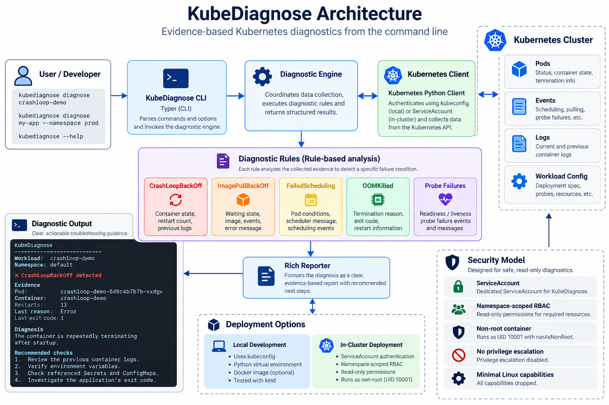

# KubeDiagnose

[](https://github.com/keshav2613/kubediagnose/actions/workflows/ci.yml)
[](https://github.com/keshav2613/kubediagnose/actions/workflows/security.yml)


**Evidence-based Kubernetes workload diagnostics from the command line.**

KubeDiagnose is a lightweight Python CLI for diagnosing common Kubernetes workload failures. It inspects workload state, pod and container status, Kubernetes events, termination information, and container logs to identify failure conditions and provide actionable troubleshooting guidance.

Instead of manually working through multiple `kubectl get`, `describe`, `logs`, and event commands, KubeDiagnose brings the most relevant evidence together into a single diagnostic report.

---

## Architecture

<p align="center">
  
</p>

## Why KubeDiagnose?

A Kubernetes workload that is not healthy can fail for many different reasons:

- an application repeatedly crashes
- an image cannot be pulled
- the scheduler cannot place the pod
- a container exceeds its memory limit
- readiness or liveness probes fail

Kubernetes exposes the evidence, but it is often distributed across pod status, container state, events, logs, and workload configuration.

KubeDiagnose analyzes that evidence and produces a concise diagnosis.

```bash
kubediagnose diagnose crashloop-demo
```

Example:

```text
KubeDiagnose
──────────────────────────────────────────────────
Workload:  crashloop-demo
Namespace: default

✓ Connected to Kubernetes API
Deployment replicas: 0/1

Pods
  crashloop-demo-5d8c4b7b7b-vxdgv     Running

✗ CrashLoopBackOff detected

Evidence
Pod:            crashloop-demo-5d8c4b7b7b-vxdgv
Container:      crashloop-demo
Restarts:       13
Last reason:    Error
Last exit code: 1

Previous container logs
KubeDiagnose demo: application startup failed

Diagnosis
The container is repeatedly terminating after startup.

Recommended checks
1. Review the previous container logs.
2. Verify environment variables and application configuration.
3. Check referenced Secrets and ConfigMaps.
4. Investigate the application's exit code.
```

---

## Supported Diagnoses

KubeDiagnose currently detects five common Kubernetes workload failure categories.

| Failure | Evidence analyzed |
|---|---|
| `CrashLoopBackOff` | Container state, restart count, previous termination state, exit code, previous logs |
| `ImagePullBackOff` / `ErrImagePull` | Waiting state, configured image, Kubernetes message, pod events |
| `FailedScheduling` | Pod conditions, scheduler reason/message, scheduling events |
| `OOMKilled` | Previous container termination reason, exit code, restart information |
| Probe failures | Kubernetes events and readiness/liveness probe failure messages |

The diagnostic engine is rule-based and evidence-driven. KubeDiagnose does not modify workloads while diagnosing them.

---

## Architecture

```text
                         KubeDiagnose
                              │
                              ▼
                         Python CLI
                           (Typer)
                              │
                              ▼
                     Diagnostic Engine
                              │
              ┌───────────────┴───────────────┐
              │                               │
              ▼                               ▼
      Kubernetes Client                Diagnostic Rules
              │                               │
              │                 ┌─────────────┼─────────────┐
              │                 │             │             │
              │                 ▼             ▼             ▼
              │             CrashLoop     Image Pull    Scheduling
              │                 │             │             │
              │                 ├─────────────┴──────┐      │
              │                 ▼                    ▼      │
              │              OOMKilled          Probe Failure
              │
              ▼
       Kubernetes API
              │
      ┌───────┼────────┐
      ▼       ▼        ▼
    Pods    Events    Logs
      │
      └──────────────────────────┐
                                 ▼
                         Evidence + Diagnosis
                                 │
                                 ▼
                           Rich Reporter
```

KubeDiagnose supports both:

- local Kubernetes access through kubeconfig
- in-cluster access through a Kubernetes ServiceAccount

---

## Requirements

For local development:

- Python 3.11+
- Kubernetes cluster
- `kubectl`
- Docker
- kind (recommended for local testing)

Verify cluster access:

```bash
kubectl get nodes
```

---

## Installation

Clone the repository:

```bash
git clone https://github.com/keshav2613/kubediagnose.git
cd kubediagnose
```

Create a virtual environment:

### Windows PowerShell

```powershell
python -m venv .venv
.\.venv\Scripts\Activate.ps1
```

### Linux / macOS

```bash
python3 -m venv .venv
source .venv/bin/activate
```

Install KubeDiagnose:

```bash
python -m pip install --upgrade pip
pip install -e .
```

Verify:

```bash
kubediagnose version
```

---

## Usage

Diagnose a deployment:

```bash
kubediagnose diagnose <deployment-name>
```

Example:

```bash
kubediagnose diagnose crashloop-demo
```

Specify another namespace:

```bash
kubediagnose diagnose my-app --namespace production
```

Display CLI help:

```bash
kubediagnose --help
```

---

## Failure Labs

The repository contains intentionally broken Kubernetes workloads for reproducing each supported failure condition.

```text
failure-labs/
├── crashloop/
│   └── deployment.yaml
├── imagepull/
│   └── deployment.yaml
├── oomkilled/
│   └── deployment.yaml
├── probe/
│   └── deployment.yaml
└── scheduling/
    └── deployment.yaml
```

For example:

```bash
kubectl apply -f failure-labs/crashloop/deployment.yaml
```

Inspect the workload:

```bash
kubectl get pods
```

Then diagnose it:

```bash
kubediagnose diagnose crashloop-demo
```

Remove the lab afterward:

```bash
kubectl delete -f failure-labs/crashloop/deployment.yaml
```

These labs make the diagnostic behaviour reproducible without requiring failures in a real application.

---

## Running with Docker

Build the image:

```bash
docker build -t kubediagnose:0.1.0 .
```

Verify the CLI:

```bash
docker run --rm kubediagnose:0.1.0 version
```

The production image runs as a non-root user.

```bash
docker run --rm --entrypoint id kubediagnose:0.1.0 -u
```

Expected:

```text
10001
```

---

## Running Inside Kubernetes

KubeDiagnose can also run inside the cluster and authenticate using its ServiceAccount rather than a local kubeconfig.

Build the image:

```bash
docker build -t kubediagnose:0.1.0 .
```

For a local kind cluster:

```bash
kind load docker-image kubediagnose:0.1.0 --name kubediagnose-dev
```

Apply RBAC:

```bash
kubectl apply -f k8s/rbac.yaml
```

Deploy KubeDiagnose:

```bash
kubectl apply -f k8s/deployment.yaml
```

Check the pod:

```bash
kubectl get pods -l app=kubediagnose
```

Run a diagnosis from inside the cluster:

```bash
kubectl exec deployment/kubediagnose -- \
  kubediagnose diagnose crashloop-demo
```

No kubeconfig or Kubernetes credentials are baked into the container image.

---

## Security Model

KubeDiagnose is designed to operate with read-only Kubernetes access.

The Kubernetes deployment uses:

- dedicated ServiceAccount
- namespace-scoped RBAC
- read-only Kubernetes API permissions
- non-root container execution
- `runAsNonRoot`
- privilege escalation disabled
- Linux capabilities dropped

The container runs using UID:

```text
10001
```

The ServiceAccount can inspect resources required for diagnostics but is not intended to modify application workloads.

For example:

```bash
kubectl auth can-i list pods \
  --as=system:serviceaccount:default:kubediagnose
```

Expected:

```text
yes
```

While destructive access should remain unavailable:

```bash
kubectl auth can-i delete pods \
  --as=system:serviceaccount:default:kubediagnose
```

Expected:

```text
no
```

---

## Testing

Run the test suite:

```bash
pytest -v
```

Run static analysis:

```bash
ruff check .
```

The test suite covers the diagnostic engine and individual failure rules.

```text
tests/
├── test_crashloop.py
├── test_engine.py
├── test_imagepull.py
├── test_oom.py
├── test_probes.py
└── test_scheduling.py
```

---

## CI/CD and Security

GitHub Actions automatically validates changes pushed to the repository and pull requests targeting `main`.

### CI pipeline

The CI workflow performs:

```text
Source
  │
  ├──► Install package
  │
  ├──► Ruff
  │
  ├──► pytest
  │
  └──► Docker build
           │
           ├──► CLI smoke test
           └──► Non-root verification
```

### Security pipeline

The security workflow performs:

```text
Source
  │
  ├──► pip-audit
  │      └── Python dependency vulnerabilities
  │
  └──► Docker build
           │
           └──► Trivy
                  └── HIGH / CRITICAL vulnerability gate
```

The security pipeline is configured to fail when actionable high-severity or critical vulnerabilities are detected.

---

## Project Structure

```text
kubediagnose/
├── .github/
│   └── workflows/
│       ├── ci.yml
│       └── security.yml
│
├── failure-labs/
│   ├── crashloop/
│   ├── imagepull/
│   ├── oomkilled/
│   ├── probe/
│   └── scheduling/
│
├── k8s/
│   ├── deployment.yaml
│   └── rbac.yaml
│
├── kubediagnose/
│   ├── rules/
│   │   ├── crashloop.py
│   │   ├── imagepull.py
│   │   ├── oom.py
│   │   ├── probes.py
│   │   └── scheduling.py
│   │
│   ├── cli.py
│   ├── engine.py
│   ├── k8s_client.py
│   ├── models.py
│   └── reporter.py
│
├── tests/
├── Dockerfile
├── pyproject.toml
└── README.md
```

---

## Design Principles

KubeDiagnose follows several simple principles:

**Evidence first**  
A diagnosis should be supported by observable Kubernetes state rather than guesswork.

**Read-only by default**  
A troubleshooting tool should not require permission to modify application workloads.

**Actionable output**  
Reports should explain both what was detected and what an engineer should investigate next.

**Reproducibility**  
Failure labs make supported diagnostic scenarios easy to recreate and test.

**Small, focused rules**  
Individual diagnostic rules remain isolated so additional failure conditions can be added without turning the engine into a large monolithic implementation.

---

## Current Limitations

KubeDiagnose `0.1.x` currently:

- diagnoses Deployments
- focuses on pod/container-level failures
- uses deterministic diagnostic rules
- performs diagnostics within a selected namespace
- does not automatically modify or repair workloads

It is intended as a troubleshooting assistant, not an autonomous remediation system.

---

## Roadmap

Potential future improvements include:

- StatefulSet and DaemonSet support
- PVC and storage failure diagnostics
- DNS and service connectivity diagnostics
- node health analysis
- ConfigMap and Secret reference validation
- structured JSON output
- multi-namespace diagnostics
- additional diagnostic rules
- richer correlation between events, logs, and workload configuration

---

## Technology

KubeDiagnose is built with:

- Python
- Typer
- Rich
- Kubernetes Python Client
- pytest
- Ruff
- Docker
- Kubernetes
- kind
- GitHub Actions
- pip-audit
- Trivy

---

## Contributing

Issues and pull requests are welcome.

For development:

```bash
git clone https://github.com/<your-username>/kubediagnose.git
cd kubediagnose

python -m venv .venv
pip install -e .
pip install pytest ruff

ruff check .
pytest -v
```

When adding a new diagnostic rule, include tests and, where practical, a reproducible Kubernetes failure lab.

---

## License

This project is licensed under the MIT License.

---

**KubeDiagnose — turn Kubernetes failure signals into actionable diagnostics.**